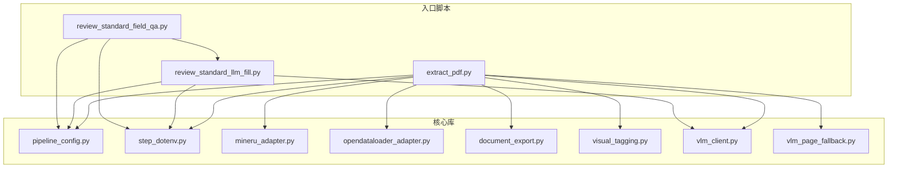

# OpenDataLoader PDF 抽取与评审标准 LLM 管线

本项目围绕 **PDF 批量解析**（MinerU / OpenDataLoader）、**统一文档 JSON**、**Markdown 导出**，以及 **评审标准 JSON 的大模型补全与栏目标注** 串联成可配置脚本；配置集中在根目录 `pipeline.json`（或 `--config` 指定文件），密钥与 API 基址可放在 `.env` / `环节变量.env`（见 `step_dotenv.py`）。

## 技术栈

- Python 3.12+（`requirements.txt` 注释以 3.12 为例）
- `opendataloader-pdf[hybrid]`（Hybrid 需单独启动 Docling 服务时见 `requirements.txt` 内说明）
- MinerU 后端：本地 MinerU 仓库 + `mineru_adapter` 子进程调用
- `PyMuPDF`、`Pillow`：VLM 页渲染等
- `python-dotenv`：可选，用于加载 `.env`
- OpenDataLoader 路径需系统 **Java 11+**
- 视觉 `clip` 模式：`transformers` / `torch`（在 `visual_tagging` 内按需懒加载）

## 快速开始

```text
py -3.12 -m venv venv312
.\venv312\Scripts\activate
pip install -r requirements.txt
```

复制并编辑 `config/pipeline.example.json` 为根目录 `pipeline.json`，按需填写 `mineru_project_root`、`input`、`output_dir` 等。大模型相关环境变量见各脚本模块顶部的文档字符串（`LLM_API_BASE` 为完整 Chat Completions POST URL；`LLM_API_KEY` 与可选的 `LLM_API_KEY_BACKUP1`、`LLM_API_KEY_BACKUP2` 在 429/503 时自动轮换；以及 `LLM_MODEL` 等）。

## 文件说明（核心 Python）

| 文件 | 作用 |
|------|------|
| `extract_pdf.py` | **主入口**：读 `pipeline.json`，选 MinerU 或 OpenDataLoader 抽取 PDF，写统一 JSON，可选导出 Markdown、视觉标签、VLM 回退转写。 |
| `pipeline_config.py` | **配置层**：从环境变量与 JSON 合并默认项、解析 `pipeline.json` 路径、从 `argv` 弹出 `--config` 等；无业务脚本依赖。 |
| `pipeline.json` | **运行时配置**（示例见 `config/pipeline.example.json`）：后端、路径、Hybrid、VLM、评审标准环节路径等。 |
| `mineru_adapter.py` | 调用本地 MinerU CLI，将 `content_list` 转为项目内统一 `document` 结构。 |
| `opendataloader_adapter.py` | 调用 `opendataloader_pdf.convert`，Java 进程解析 PDF 并载入为统一结构。 |
| `document_export.py` | 将统一 `document` 转为整篇 Markdown 或按页 Markdown（供下游 LLM 使用）。 |
| `visual_tagging.py` | 对文档内裁剪图做 **CLIP** 或 **VLM** 分类（签名/指印/印章），把标签写回节点。 |
| `vlm_client.py` | OpenAI 兼容 **Chat Completions** HTTP 客户端（视觉消息、整页转写）；`join_openai_compatible_endpoint_url` 在「仅完整 URL」或「基址 + 路径」两种 `pipeline.json` 写法下解析最终 POST 地址。 |
| `vlm_page_fallback.py` | 判断弱文本页、渲染 PNG、调用 VLM 转写并合并回文档（逻辑与具体 VLM 调用由 `extract_pdf` 注入）。 |
| `review_standard_llm_fill.py` | 按评审标准一级字段轮询 **文本 LLM**，把表格抽取结果写入「大模型返回结果」字段。 |
| `review_standard_field_qa.py` | 在上一环节产出基础上，按子字段与「要求」调用 LLM，把答案写入「内容」。 |
| `step_dotenv.py` | 在相关脚本**导入时**加载项目根 / 当前目录的 `.env` 与 `环节变量.env`（幂等）。 |

## 测试与样例数据

| 路径 | 作用 |
|------|------|
| `tests/` | 各模块单元测试；`pytest tests/` 仅收集本目录，不包含子仓库。 |
| `评审标准.json` | 评审标准结构样例（测试或演示用）。 |
| `scripts/start_docling_hybrid.ps1` | 启动 Hybrid（Docling）服务的辅助脚本（与 `requirements.txt` 说明一致）。 |

## 模块依赖关系（简要）

箭头表示「导入或运行时调用」；stdlib 未画出。



**文字归纳：**

1. **`pipeline_config`** 被三个入口共用，负责「环境变量 + `pipeline.json` + 命令行」的合并与路径解析。  
2. **`step_dotenv`** 被三个入口在导入早期调用，保证 `LLM_*` 等变量从 `.env` 注入后再读配置。  
3. **`extract_pdf`** 编排 **`mineru_adapter` / `opendataloader_adapter`** 得到统一文档，经 **`document_export`** 写 Markdown；可选 **`visual_tagging`**（内部可按模式用 CLIP 或调用 **`vlm_client`** 构建的接口）与 **`vlm_page_fallback`**（页图 + VLM 转写）。  
4. **`review_standard_llm_fill`** 依赖 **`vlm_client`**（复用响应解析与 URL 拼接）与 **`pipeline_config`**；**`review_standard_field_qa`** 再依赖 **`review_standard_llm_fill`** 中的配置、遍历与 HTTP 调用。  
5. **`vlm_client`**、**`vlm_page_fallback`**、**`mineru_adapter`**、**`opendataloader_adapter`**、**`document_export`** 彼此不导入对方，由 **`extract_pdf`** 串联。

## 许可证

若仓库未单独提供许可证文件，以你方仓库根目录的 `LICENSE` 为准（如无则待补充）。
