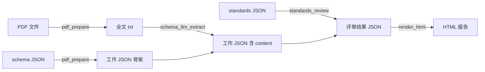

# file_flow — 行政执法案卷 PDF 智能解析管线

## 项目定位

file_flow 是一个基于 **OpenDataLoader** + **大模型（LLM）** 的自动化案卷解析管线，将行政执法案卷的 PDF 文件按自定义 schema 抽取结构化字段，并对照评审标准清单逐项进行智能评审。

**核心流程**：PDF 全文抽取 → Schema 字段摘录（LLM）→ 标准清单评审（LLM）→ HTML 可视化

## 管线步骤

```
pdf_prepare → schema_llm_extract → standards_review → render_html
```

| 步骤 | 模块 | 职责 |
|------|------|------|
| **① pdf_prepare** | `pdf_prepare.py` + `pdf_text_extract.py` | 读取 PDF 目录，调用 OpenDataLoader（可选 Hybrid/Docling 增强）提取全文，按 schema 模板生成 `*_work.json` 骨架 + `*_fulltext.txt` |
| **② schema_llm_extract** | `schema_llm_extract.py` | 读取 `*_work.json` 与全文，按 `field_name` + `description` 逐字段调用 LLM 摘录原文，写入 `content` |
| **③ standards_review** | `standards_llm_review.py` | 读取评审标准清单 `standards.json`，按 `number` 关联到案卷字段，逐项调用 LLM 判断「符合/不符合」并给出依据，写入 `standards_review` |
| **④ render_html** | `render_html.py` | 将最终 JSON 渲染为单文件 HTML，左右分栏展示字段摘录与评审结果 |

### 辅助模块

| 模块 | 职责 |
|------|------|
| `pipeline_merge.py` | 管线编排入口：按 `file_flow_steps` 顺序调用各步骤（支持批量/自动 glob） |
| `pipeline_config.py` | 配置加载：仅从 `pipeline.json` 读取 `CONFIG_KEYS` 允许的键，不与环境变量合并 |
| `llm_openai.py` | LLM 调用封装：OpenAI 兼容 Chat Completions（`urllib` 原生实现），支持多密钥环形轮换（主 + 4 备份） |
| `naming.py` | 产出 JSON 文件名后缀控制（`_work` / `_answered` / `_review`） |
| `step_dotenv.py` | 环境变量加载：加载 `file_flow/.env`、父目录 `.env`、`环节变量.env` |
| `aggregate_review_items.py` | 从 schema 中提取 `related_review_items`，按编号聚合生成 `document_review_items.json` 和 `field_review_items.json` |
| `prompt_stage_samples.py` | 打印各阶段将发给 LLM 的完整 prompt 样例（不含真实 API 调用） |
| `run_micro_test.py` | 微缩测试管线：裁剪 schema（前 10% document_types）与 standards（前 N 条），跑全流程 |
| `document_export.py` | 将统一文档 JSON（kids 树）导出为 Markdown |
| `opendataloader_adapter.py` | OpenDataLoader Java 管线适配层（调用 `opendataloader_pdf.convert`，处理中文路径）；含 `0.0.0.0` → `127.0.0.1` 自动规范 |

## 快速启动

### 环境要求

- Python 3.10+
- Java 11+（OpenDataLoader 管线）
- pip 依赖：`opendataloader-pdf`、`python-dotenv`、`PyMuPDF`（回退抽取用）

### 基本用法

```bash
# 在仓库根目录执行

# 一键执行全流程
python -m file_flow.pipeline_merge

# 仅执行 PDF 准备步骤
python -m file_flow.pdf_prepare --config file_flow/pipeline.json

# 仅执行 schema 摘录
python -m file_flow.schema_llm_extract -i out/某案_work.json

# 仅执行标准清单评审
python -m file_flow.standards_llm_review -i out/某案_work.json

# 将结果渲染为 HTML
python -m file_flow.render_html -i out/某案_work.json -o out/某案.html

# 查看各阶段 prompt 示例（dry-run，不调 API）
python -m file_flow.prompt_stage_samples
```

### 配置

管线配置仅来自 `file_flow/pipeline.json`（或 `--config` 指定文件），密钥放在 `.env` 文件中。

**核心配置项**：

| 键 | 说明 |
|----|------|
| `file_flow_pdf_dir` | PDF 源目录 |
| `file_flow_schema_json` | Schema JSON 路径（定义 document_types 与 fields） |
| `file_flow_standards_json` | 评审标准清单 JSON 路径 |
| `file_flow_out_dir` | 输出目录 |
| `file_flow_steps` | 执行步骤列表 |
| `file_flow_llm_extract` | 是否启用 LLM 字段摘录 |
| `backend` | PDF 解析后端（`opendataloader` / `mineru`） |
| `hybrid` | Docling Hybrid 模式（`docling-fast` / `off`） |
| `hybrid_url` | Hybrid 服务地址（如 `http://127.0.0.1:5002`） |

### 环境变量

在 `file_flow/.env` 或仓库根 `.env` 中配置：

```bash
LLM_API_BASE=https://api.openai.com/v1
LLM_MODEL=gpt-4o
LLM_API_KEY=sk-xxx
# 可选：备用密钥（最多 4 个），遇限流自动轮换
LLM_API_KEY_BACKUP1=sk-yyy
LLM_API_KEY_BACKUP2=sk-zzz
LLM_TIMEOUT_SEC=120
```

## 数据流



### 产出文件

| 文件 | 说明 |
|------|------|
| `out/{案卷名}_work.json` | 工作 JSON（含 schema 骨架 + LLM 摘录的 `content`） |
| `out/{案卷名}_fulltext.txt` | PDF 全文文本 |
| `out/{案卷名}_review.json` | 评审结果（含 `standards_review` 各项判断） |
| `out/{案卷名}_review.html` | 可视化 HTML 报告 |
| `out/document_review_items.json` | 按评审编号聚合的文书级关联 |
| `out/field_review_items.json` | 按评审编号聚合的字段级关联 |

### Schema 示例

见 `out/schema_example.json`：定义案卷包含的文书类型（document_types）、各文书下的字段（fields），以及字段与评审标准编号的关联（related_review_items）。

### 评审标准示例

见 `out/standards_example.json`：定义评审条目（category / subcategory / content / standard），每条可关联到 schema 中的字段。

## 微缩测试（Micro Test）

开发和调试时可用微缩模式跑完整管线，避免处理全量数据拖慢迭代：

```bash
# 默认：schema 前 10% + standards 前 3 条，dry-run 不调 LLM
python -m file_flow.run_micro_test --dry-run

# 自定义比例，启用 LLM
python -m file_flow.run_micro_test --schema-pct 20 --standards-n 5

# 使用自定义管线配置
python -m file_flow.run_micro_test --config my_pipeline.json --dry-run
```

**效果**：
- 自动裁剪 `schema_example.json` 至前 10% document_types → `out/schema_micro.json`
- 自动裁剪 `standards_example.json` 至前 N 条 items → `out/standards_micro.json`
- 基于裁剪 schema 重新聚合 `field_review_items` → `out/field_review_items_micro.json`
- 管线产出文件名后缀追加 `_micro`（如 `某案_work_micro.json`），不与正式运行混淆

## 注意事项

- `file_flow` 暂不支持 `backend=mineru`，配置为 mineru 时自动降级为 PyMuPDF 本地抽取
- `0.0.0.0` 作为 `hybrid_url` 会被自动规范为 `127.0.0.1`
- 产出文件名后缀由 `file_flow_suffix_work` / `_answered` / `_review` 控制，默认 `_work` / `_answered` / `_review`
- 当前维护进度跟踪位于 `file_flow/` 目录下的 git 变更；跨设备跟进可通过该 README 核对功能完整性
